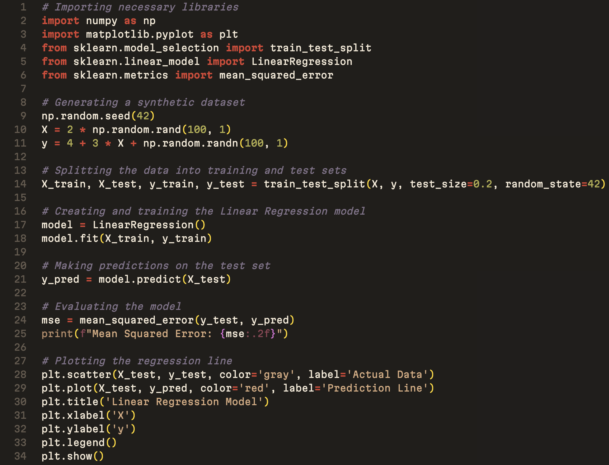
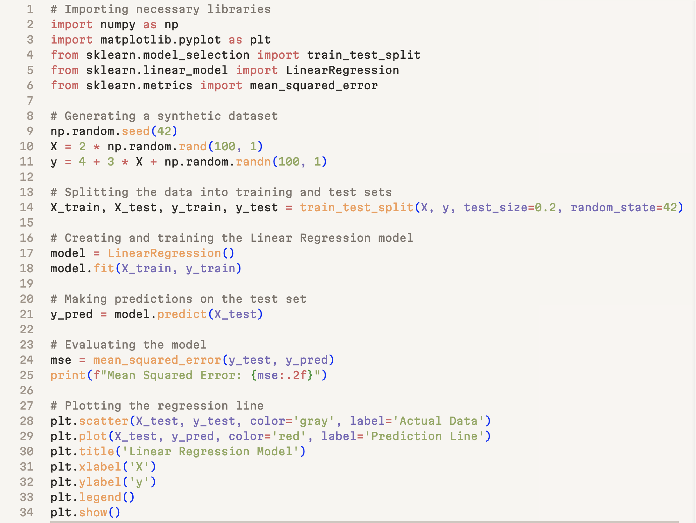

# Autumn Breeze

**Autumn Breeze Theme** is a theme for Visual Studio Code inspired by the calm and earthy tones of autumn. This theme combines a soft ivory background with subtle, autumnal hues, creating a refined and comfortable environment for coding. Whether you spend long hours programming or want a soothing aesthetic, this theme is designed to reduce eye strain while maintaining clarity and focus.

## Screen-shots




## 🛠️ Features

- **Subtle UI**: The theme's UI uses shared muted tones, creating a cohesive and unobtrusive experience that blends seamlessly with the background. Sidebars, activity bars, and the terminal are carefully colored to maintain focus on your code.
- **Python Optimized**: This theme includes specialized syntax highlighting for Python, making key elements like functions, decorators, and keywords stand out in a natural and elegant way.
- **Readable Contrast**: Despite its softness, the theme maintains strong enough contrast to ensure text remains readable while avoiding the harshness of typical high-contrast themes.

## 📝 Installation

1. Open Visual Studio Code.
2. Go to the **Extensions** view by clicking on the Extensions icon in the Activity Bar or by pressing `Ctrl+Shift+X`.
3. Search for **"Soft Ivory Autumn Theme"**.
4. Click **Install** to add the theme.
5. Open the **Command Palette** (`Ctrl+Shift+P`) and type "Color Theme".
6. Choose **Soft Ivory Autumn Theme** from the list of available themes.

## 💻 Supported Languages

This theme works beautifully across a variety of programming languages. It includes special syntax highlighting for:
- **Python**
- **JavaScript**
- **TypeScript**
- **HTML/CSS**
- **Markdown**
- **JSON**
- And many more!

## 📚 Recommended Settings

To fully enjoy the aesthetic of this theme, here are some recommended VS Code settings:
```json
{
  "workbench.colorTheme": "Autumn Breeze Theme",
  "editor.fontFamily": "'Martian Mono', 'Courier New', monospace",
  "editor.fontLigatures": true,
  "editor.lineHeight": 22,
  "editor.cursorSmoothCaretAnimation": true
}
```

## 🖌️ Contributing

We welcome contributions! If you'd like to suggest improvements, new features, or even report bugs, feel free to open an issue or submit a pull request on the GitHub repository.

## 🎉 Enjoy!

Thank you for using **Autumn Breeze Theme**! We hope it brings a warm and pleasant atmosphere to your coding sessions. If you enjoy the theme, don't forget to leave a review in the Visual Studio Code Marketplace.
